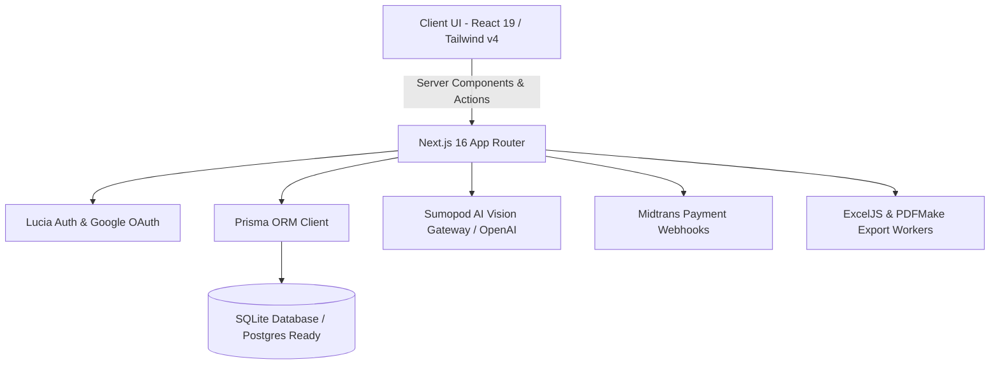

# 💰 Duitku — Modern Personal Finance & AI Receipt Scanner

[](https://nextjs.org/)
[](https://react.dev/)
[](https://www.typescriptlang.org/)
[](https://tailwindcss.com/)
[](https://www.prisma.io/)
[](LICENSE)
[](./lib/i18n)

> An enterprise-grade, full-stack personal finance application with **AI-powered receipt scanning (OCR & structured parsing)**, comprehensive multi-period analytics, ledger-grade balance computation, bilingual support (English / Indonesian), and multi-format exports (PDF, Excel, HTML).

---

## 🌟 Key Highlights for Engineering Teams

* **🤖 Multimodal AI Receipt Scanning**: Upload or capture receipt photos via live camera; vision LLMs (GPT-4o / GPT-4o-mini / Gemini) extract merchant names, line items, timestamps, and total amounts. Includes a sandbox **Mock Mode** for zero-cost offline development.
* **🛡️ Zero Balance Drift (Derived Financial Ledger)**: Account balances are never stored as mutable numbers; they are dynamically computed on-demand from verified transaction records (`initialBalance + Σ income − Σ expense ± transfer`), eliminating double-spend and state divergence bugs.
* **⚖️ Dedicated Debt & Loan Lifecycle**: Separates operating expenses from capital disbursements and debt repayments with remaining principal tracking and loan status management.
* **🌐 Full Bilingual Internationalization (i18n)**: Fully localized in **English (default)** and **Indonesian**, with zero-lag client switching, SSR hydration safety, and persistent preference synchronization.
* **📊 Business Intelligence & Export Engine**: High-performance multi-period reports (Daily, Weekly, Monthly, Annual) with dynamic trend charts and one-click export to native **Excel (.xlsx)** via `ExcelJS`, styled **PDF** via `pdfmake`, and print-ready **HTML**.
* **🔐 Production Auth & Session Management**: Built on **Lucia Auth** with Argon2id password hashing, Google OAuth 2.0 via Arctic, HTTP-only secure session cookies, and instant 3-day guest demo access.
* **💳 Payment Gateway Integration**: Integrated with **Midtrans Payment Gateway** supporting Snap checkout, Virtual Accounts, e-Wallets, QRIS, and automated webhook subscription fulfillment.

---

## 🏗️ Architecture & Tech Stack



| Layer | Technology | Details / Rationale |
| :--- | :--- | :--- |
| **Framework** | **Next.js 16.3 (App Router)** | Server Components, Turbopack, route handlers, dynamic edge caching |
| **Frontend** | **React 19 & Tailwind CSS v4** | Modern micro-interactions, responsive mobile-first UI, Lucide icons |
| **State & i18n** | **React Context & Custom Hooks** | Typesafe dictionary system supporting EN (Default) & ID locales |
| **Database & ORM** | **Prisma 6.19 + SQLite** | Declarative schema, relational integrity, seamless migration to PostgreSQL |
| **Auth & Security** | **Lucia Auth v3 + Argon2id** | Robust session validation, CSRF/XSS resistant cookies, RBAC (User/Admin) |
| **AI Vision Engine**| **Sumopod Gateway / OpenAI SDK** | Few-shot receipt OCR extraction with schema validation and fallback modes |
| **Analytics & Viz** | **Recharts** | Interactive categorical breakdowns, cash flow curves, and financial ratios |
| **Document Export**| **ExcelJS & PDFMake 0.2** | Server-side buffered document generation with customized styling |
| **Payment Gateway**| **Midtrans Client SDK** | Tokenized transactions, webhook signature validation, PRO upgrades |

---

## 📸 Core Capabilities

### 1. AI Receipt Scanner & OCR Pipeline
- Live camera capture with aspect-ratio guidance or direct file upload.
- Client-side image compression (under 4MB) to minimize token consumption and latency.
- Intelligent structured JSON extraction (merchant name, total amount, transaction date, suggested category).
- **Human-in-the-loop review modal**: AI extracts metadata, but the user confirms or edits fields before any database write occurs.

### 2. Double-Entry Inspired Account Management
- Supports multiple financial accounts: **Bank Accounts**, **E-Wallets** (GoPay, OVO, Dana), and **Cash Wallets**.
- Internal transfers seamlessly credit the destination account and debit the source account in a single atomic transaction.
- Category classification with custom color tags and Lucide icons.

### 3. Debt, Loan, and Installment Tracker
- Real-time loan tracking with principal, interest notes, due dates, and lenders.
- Differentiates operational spending from balance adjustments (e.g. debt disbursement increases liquid cash without counting as taxable income).
- Automatic status transition to **Settled** upon full repayment.

### 4. Comprehensive Reporting & Document Exports
- Multi-dimensional aggregation filters: Daily, Weekly, Monthly, and Yearly.
- Visual breakdown of income sources vs. expense categories.
- Export clean, formatted financial statements to **Excel (.xlsx)**, **PDF**, or **HTML** with customized metadata headers.

---

## 🚀 Quick Start & Local Setup

### Prerequisites
- **Node.js**: `v20.x` or higher
- **npm** or **pnpm**

### 1. Clone & Install
```bash
git clone https://github.com/kangnova/app_keuangan.git
cd app_keuangan

# Install dependencies (auto-runs prisma generate via postinstall)
npm install
```

### 2. Configure Environment Variables
Copy `.env.example` to `.env` and fill in necessary keys:
```bash
cp .env.example .env
```

```env
# Database (Local SQLite)
DATABASE_URL="file:./dev.db"

# Authentication
APP_ENCRYPTION_KEY="generate-32-character-secret-key"

# AI Receipt Scan (Sumopod / OpenAI Gateway)
SUMOPOD_API_KEY="sk-..."
SUMOPOD_BASE_URL="https://ai.sumopod.com/v1"
SUMOPOD_VISION_MODEL="gpt-4o-mini"
SCAN_MOCK_MODE="0" # Set to "1" for offline demo mode without API key

# Google OAuth (Optional)
GOOGLE_CLIENT_ID=""
GOOGLE_CLIENT_SECRET=""

# Midtrans Payments (Optional)
MIDTRANS_SERVER_KEY=""
MIDTRANS_CLIENT_KEY=""
MIDTRANS_IS_PRODUCTION="false"
NEXT_PUBLIC_APP_URL="http://localhost:3000"
```

### 3. Database Migration & Seeding
```bash
# Apply migrations to SQLite database
npm run db:migrate

# Seed default categories, demo user, and accounts
npm run db:seed
```

### 4. Run Development Server
```bash
npm run dev
```

Open [http://localhost:3000](http://localhost:3000) in your browser.

---

## 📂 Repository Structure

```text
app_keuangan/
├── app/                        # Next.js App Router
│   ├── (auth)/                 # Login & Registration flows
│   ├── accounts/               # Account management page
│   ├── admin/                  # Admin console & server telemetry
│   ├── api/                    # REST API route handlers
│   │   ├── auth/               # Login, logout, register, demo endpoints
│   │   ├── debts/              # Debt & loan CRUD + payments
│   │   ├── export/             # PDF, Excel, and HTML export handlers
│   │   ├── payments/           # Midtrans subscription & webhook processing
│   │   ├── reports/            # Analytical aggregation queries
│   │   ├── scan/               # AI Receipt Vision processing
│   │   └── transactions/       # Transaction CRUD & transfers
│   ├── categories/             # Category management
│   ├── debts/                  # Debt tracking dashboard
│   ├── demo/                   # 3-day instant guest trial entry
│   ├── reports/                # Multi-period analytics & charts
│   ├── scan/                   # Receipt scan & OCR review interface
│   ├── settings/               # System & AI model configuration
│   ├── subscribe/              # PRO subscription & Midtrans payment UI
│   ├── layout.tsx              # Root HTML wrapper with theme & i18n
│   └── page.tsx                # Dynamic Landing page & Dashboard
├── components/                 # Reusable UI & Client Components
│   ├── layout/                 # Navigation header & responsive app shell
│   ├── ui/                     # Form controls, modals, sheets, badges
│   ├── accounts-client.tsx     # Account listing & balance manager
│   ├── dashboard-client.tsx    # Live authenticated dashboard
│   ├── landing-page-client.tsx # Public marketing landing page
│   ├── language-toggle.tsx     # Instant EN/ID language switcher
│   ├── live-camera-modal.tsx   # Camera capture interface
│   ├── quick-actions.tsx       # Expense, income & transfer modals
│   ├── theme-toggle.tsx        # Dark / Light mode toggle
│   ├── tx-form.tsx             # Universal transaction modal
│   └── tx-list.tsx             # Filterable transaction feed
├── lib/                        # Domain logic & utilities
│   ├── ai.ts                   # Sumopod/OpenAI vision integration
│   ├── auth.ts                 # Lucia Auth initialization & session validation
│   ├── balance.ts              # Balance derivation engine
│   ├── datetime.ts             # Localized date/time helpers
│   ├── format.ts               # Currency (IDR) & number formatters
│   ├── i18n/                   # Bilingual dictionary system (EN / ID)
│   └── reports.ts              # Financial aggregation algorithms
├── prisma/                     # Database layer
│   ├── schema.prisma           # Prisma schema definition
│   ├── seed.ts                 # Database seeder
│   └── migrations/             # SQL migration history
├── prisma.config.ts            # Modern Prisma 6/7 configuration
└── package.json
```

---

## 🧪 Quality Assurance & Verification

The project includes an end-to-end smoke testing script verifying 80+ assertions covering API authentication, ledger calculations, debt amortizations, and export endpoints:

```bash
# Run comprehensive TypeScript check
npx tsc --noEmit

# Production build check
npm run build
```

---

## 💡 Engineering Decisions & Best Practices

1. **Integer Arithmetic**: All monetary amounts are stored as exact integers (representing Indonesian Rupiah), avoiding floating-point precision inaccuracies during aggregation.
2. **Server-Side Authorization**: API routes validate session credentials through server-side cookies before executing database mutations.
3. **Optimistic & Resilient UI**: Client interfaces reactively update with Toast feedback (`sonner`), loading spinners, and error boundaries.
4. **Hydration-Safe Theme & i18n Sync**: Inline head scripts evaluate user settings before page paint to prevent theme flickering, protected by `suppressHydrationWarning`.

---

## 👨‍💻 Author & Contact

Developed by **Nova** — Full Stack Software Engineer specializing in modern TypeScript, React/Next.js architectures, and API design.

* **GitHub**: [@kangnova](https://github.com/kangnova)
* **Email**: Contact via GitHub profile

---

*Open for Full Stack Engineer & Backend Engineer roles (Remote / Hybrid).*